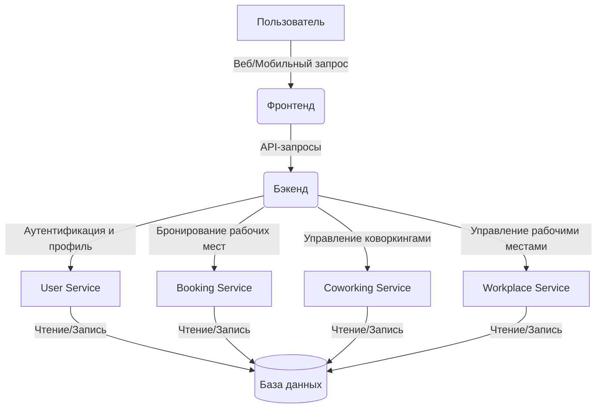

# Т-Коворкинг

Современное онлайн-приложение для бронирования, отслеживания, оплаты и прохода в коворкинг. Система предоставляет
удобный функционал как для пользователей, так и для владельцев коворкингов, позволяя быстро и просто управлять рабочими
пространствами.

---

## Содержание

- [Обзор проекта](#обзор-проекта)
- [Архитектура и сервисы](#архитектура-и-сервисы)
    - [Диаграмма взаимодействия](#диаграмма-взаимодействия)
    - [Описание сервисов](#описание-сервисов)
- [Структура проекта](#структура-проекта)
- [Документация базы данных](#документация-базы-данных)
- [Установка и запуск](#установка-и-запуск)
- [Спецификация API](#спецификация-api)
- [Тестирование](#тестирование)

---

## Обзор проекта

Проект реализует распределённую архитектуру, в которой отдельные сервисы отвечают за различные бизнес-процессы:

- **Бэкенд:** Основная логика, обработка бизнес-правил и REST API для взаимодействия с клиентами.
- **Фронтенд:** Веб-интерфейс, обеспечивающий удобное взаимодействие пользователя с системой.
- **Мобильное приложение:** (опционально) Клиент для мобильных устройств для бронирования и управления коворкингами.

Каждый компонент системы взаимодействует между собой, обеспечивая масштабируемость и гибкость решения.

---

## Архитектура и сервисы

### Диаграмма взаимодействия



### Описание сервисов

- **User Service:**  
  Отвечает за регистрацию, аутентификацию и управление данными пользователей.

- **Booking Service:**  
  Обрабатывает запросы на бронирование рабочих мест, управление бронями и историю заказов.

- **Coworking Service:**  
  Управляет созданием, редактированием и удалением коворкингов, а также тарифами и дополнительными настройками.

- **Workplace Service:**  
  Обеспечивает управление рабочими местами внутри коворкингов, включая их создание, обновление и удаление.

> **Примечание:** Взаимодействие между сервисами осуществляется через REST API (или альтернативный протокол по
> необходимости), что обеспечивает модульность и масштабируемость системы.

---

## Структура проекта

Ниже приведена основная структура проекта, отражающая разделение кода по функциональным модулям:

```plaintext
.
├── Dockerfile
├── README.md
├── docker-compose.yaml
├── docker-entrypoint-initdb.d
│   └── seed.sql
├── images
│   └── diagram.png
└── src
    ├── api_service
    │   ├── api
    │   │   └── v1
    │   │       ├── filters
    │   │       │   └── auth.py
    │   │       └── routes
    │   │           ├── booking.py
    │   │           ├── cdn.py
    │   │           ├── coworking.py
    │   │           ├── external.py
    │   │           ├── ping.py
    │   │           ├── user.py
    │   │           └── workplace.py
    │   ├── core
    │   ├── domain
    │   ├── infrastructure
    │   ├── main.py
    │   ├── tests
    │   └── ...
    └── bot_service
        ├── handlers
        ├── keyboards
        ├── main.py
        └── ...
```

Проект разделён на два основных сервиса:

- **api_service** – отвечает за API, бизнес-логику и взаимодействие с базой данных.
- **bot_service** – реализует дополнительные возможности, например, уведомления или управление через ботов.

---

## Документация базы данных

<details>
  <summary>Схема базы данных</summary>


</details>

**Основные таблицы:**

- **coworkings** – хранит данные о коворкингах.
- **coworking_tariffs** – информация о тарифах и услугах в коворкингах.
- **users** – данные пользователей системы.
- **workplaces** – данные о рабочих местах внутри коворкингов.
- **bookings** – информация о бронированиях рабочих мест.

---

## Установка и запуск

### Подготовка окружения

1. **Клонирование репозитория:**

   ```bash
   git clone https://REDACTED/team-37/backend.git
   cd backend
   ```

2. **Запуск сервисов через Docker Compose:**

   ```bash
   docker compose up -d
   ```

### Запуск Frontend

Для запуска фронтенд-сервиса выполните следующие команды:

```bash
docker pull team-37/frontend
docker run -d --name=frontend -p 5173:5173 --restart always team-37/frontend
```

---

## Спецификация API

Полная спецификация API доступна по адресу:  
[https://prod-team-37-ajc3mefd.REDACTED/api/docs](https://prod-team-37-ajc3mefd.REDACTED/api/docs)

---

## Тестирование

В проекте реализованы следующие виды тестирования:

- **E2E (интеграционные) тесты:**  
  Расположены в директории `tests/e2e` и охватывают сценарии взаимодействия между сервисами, включая:
    - Тесты бронирования (booking)
    - Тесты управления коворкингами (coworking)
    - Тесты пользователей (user)
    - Тесты рабочих мест (workplace)

- **Юнит тесты:**  
  Находятся в директории `tests/unit` и предназначены для проверки корректности работы отдельных компонентов и
  модулей.

- **Postman Collection:**  
  Файл `API Postman collection.json` содержит набор запросов для тестирования API с помощью Postman.


---

## Заключение

Данный проект реализует модульную архитектуру, что обеспечивает гибкость и масштабируемость системы. Отдельные сервисы
позволяют легко адаптироваться к изменяющимся требованиям и быстро внедрять новые функциональные возможности. Если у вас
возникнут вопросы или предложения, пожалуйста, свяжитесь с разработчиками.

---
